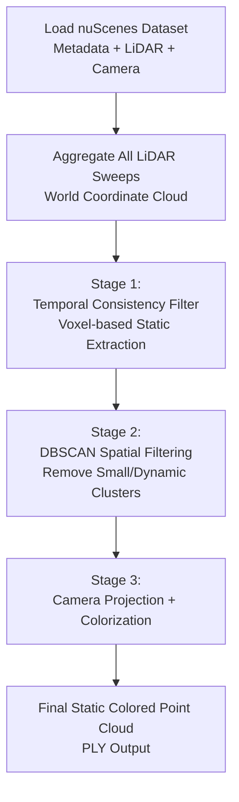
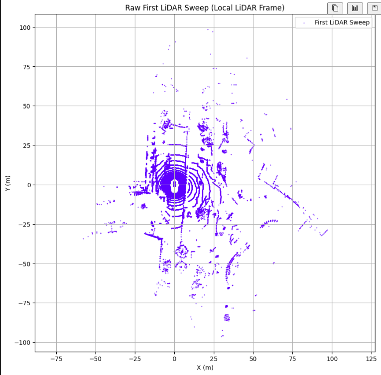
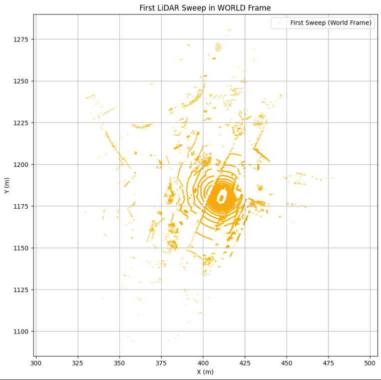
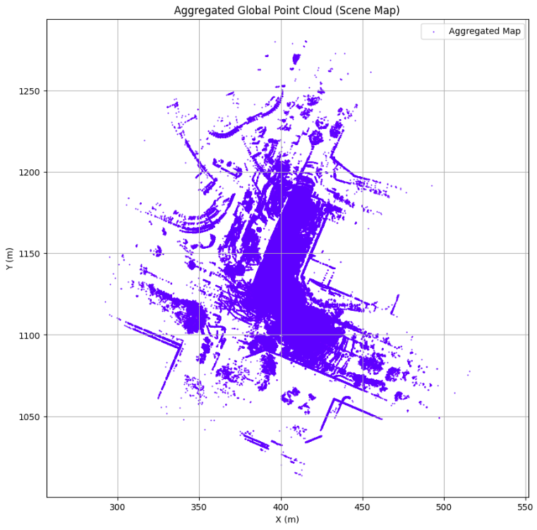
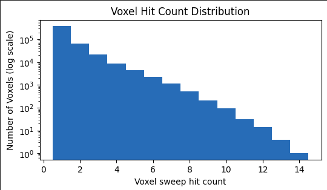
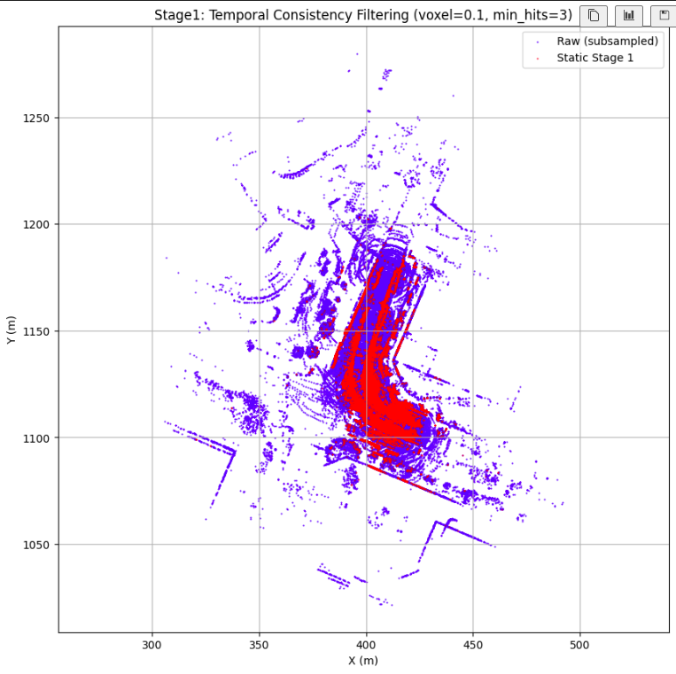
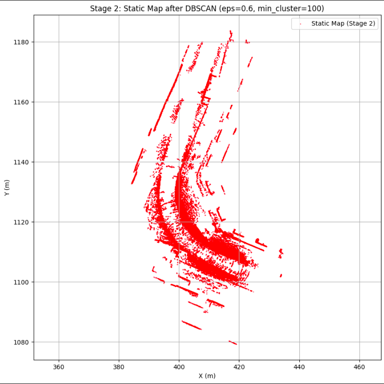

# Point Cloud Aggregation, Static Map Extraction, and Colorization using nuScenes

This repository implements a full 3D mapping pipeline using the **nuScenes (v1.0-mini)** dataset.  
All detailed explanations, visualizations, and complete executable code are provided in:

**[point_cloud_aggregation.ipynb](/point_cloud_aggregation.ipynb)**

The notebook walks through every stage of the pipeline, from loading the dataset to generating a colored static 3D map.

---

# Author

**Name:** Priyam Gupta        
**Neptun code:** KXHGEA

---

# Directory Structure

```
project_root/
│
├── dataset/
│   └── v1_0_mini/
│       ├── samples/          # Keyframe sensor data
│       ├── sweeps/           # Intermediate LiDAR sweeps
│       ├── v1.0-mini/        # JSON metadata files
│       ├── maps/             # HD map files (unused here)
│       └── LICENSE
│
├── output/
│   ├── static_stage1_vox_0.30.ply        # Static map after Stage 1 filtering
│   ├── static_stage2_DBSCAN.ply          # Static map after DBSCAN filtering
│   └── static_colored_stage3.ply         # Final colored static map
|
├── figures
|
├── final_pcd.mp4
│
└── point_cloud_aggregation.ipynb         # Main Jupyter Notebook
```

---

# Dependencies

- Python 3.8+
- NumPy
- Open3D
- Matplotlib
- Pillow
- sklearn (for KDTree fallback)
- tqdm (optional)

---

# How to Run

1. Download nuScenes v1.0-mini and place it under [dataset/v1_0_mini/](/dataset/v1_0_mini/)
2. Open the Jupyter notebook:

   ```
   jupyter notebook point_cloud_aggregation.ipynb
   ```
3. Run all cells in order.

---

# nuScenes Dataset Components Used

### 1. **LiDAR Data**
- Located in: `samples/LIDAR_TOP/` and `sweeps/LIDAR_TOP/`
- Each file: `.pcd.bin` containing N × 5 float32 values  
  Format: `[x, y, z, intensity, ring_index]`

### 2. **Camera Data**
- RGB images from 6 cameras:
  - CAM_FRONT  
  - CAM_FRONT_LEFT  
  - CAM_FRONT_RIGHT  
  - CAM_BACK  
  - CAM_BACK_LEFT  
  - CAM_BACK_RIGHT

### 3. **Calibration Files (`v1.0-mini/*.json`)**
- [calibrated_sensor.json](/dataset/v1_0_mini/v1.0-mini/calibrated_sensor.json): Provides extrinsic calibration (sensor→ego transforms).
- [ego_pose.json](/dataset/v1_0_mini/v1.0-mini/ego_pose.json): GNSS-INS global pose of the ego vehicle (ego→world transform).
- [sample_data.json](/dataset/v1_0_mini/v1.0-mini/sample_data.json): Links every sensor measurement to its sample and calibration.
- [sample.json](/dataset/v1_0_mini/v1.0-mini/sample.json): Defines keyframes and links to next/prev samples.
- [scene.json](/dataset/v1_0_mini/v1.0-mini/scene.json): Defines 20-second sequences that form a scene.
- [sensor.json](/dataset/v1_0_mini/v1.0-mini/sensor.json): Lists all sensors and their channels.

---

# Pipeline Overview

This project implements a **three-stage static mapping** system:

## **Stage 1 – LiDAR Sweep Aggregation**
- Load all LiDAR sweeps for the selected scene.
- Convert each sweep from:
  **LiDAR frame -> Ego Vehicle frame -> World frame**
- Aggregate them into a single global point cloud.

## **Stage 2 – Moving Object Removal**
Dynamic objects such as cars and pedestrians are removed in two steps:

### **2.1 Temporal Consistency Filter**
- Space is discretized into 3D voxel grid.
- A voxel is retained as *static* only if it appears in **≥ 3 sweeps**.
- Assumption:
  - Dynamic objects appear in few sweeps.
  - Static structures (roads, buildings) appear consistently.

### **2.2 DBSCAN Spatial Clustering**
- Run DBSCAN to remove isolated clusters and noise.
- Helps eliminate:
  - Stray LiDAR reflections  
  - Temporary objects  
  - Small dynamic artifacts missed by Stage 1

## **Stage 3 – Camera-Based Colorization**
- For each static point:
  - Determine which sweep it came from.
  - Project it into each camera image of that sweep.
  - Sample the RGB value from the image.
- Points visible in at least one image receive accurate color.

---

# Pipeline Block Diagram

<div align="center">



</div>

---

# Outputs

All outputs are stored in the [output/](/output/) directory:

| File | Description |
|------|-------------|
| `static_stage1_vox_0.30.ply` | Static points after voxel-based temporal filtering |
| `static_stage2_DBSCAN.ply` | Static points after DBSCAN cleanup |
| `static_colored_stage3.ply` | Final static colored 3D map |

You can visualize the final colored cloud using:
```python
import open3d as o3d
pcd = o3d.io.read_point_cloud("output/static_colored_stage3.ply")
o3d.visualization.draw_geometries([pcd])
```

---

# Why This Approach?

### 1. **LiDAR Aggregation Provides Full 3D Coverage**
A single LiDAR sweep contains occlusions.  
Aggregating multiple sweeps captures the full structure of the scene.

### 2. **Temporal Filtering Removes Dynamic Objects**
- Dynamic objects appear in few sweeps.
- Static background appears repeatedly.
- Voxel hit count gives a simple but effective classification method.

### 3. **DBSCAN Removes Noise & Small Clusters**
- Even after temporal filtering, isolated points remain.
- DBSCAN reliably removes small or noisy clusters.

### 4. **Camera Projection Adds Realistic Color**
- Colorized point clouds are:
  - Easier to interpret  
  - Useful for visualization  
  - Useful for semantic applications

---

# Results and Visualizations

This section presents intermediate and final resulst obtained from each stage of the pipeline. All figures are generated directly from the jupyter notebook [`point_cloud_aggregation.ipynb`](point_cloud_aggregation.ipynb).

### 1. Raw First LiDAR Sweep (Local LiDAR frame)

<div align="center">



</div>

This figure visualizes a **single LiDAR sweep** in the **local LiDAR coordinate frame**, before any motion compensation or global alignment.

Why this is important:

- The point cloud is centered around the LiDAR sensor.
- Circular scan patterns are visible, reflecting the rotating multi-beam LiDAR.
- Dynamic objects, occlusions, and sparsity are clearly present.


### 2. First LiDAR Sweep in World Frame

<div align="center">



</div>

This figure visualizes the same LiDAR sweep after transforing points through:

```
LiDAR frame -> Ego vehicle frame -> World frame
```
using calibration and GNSS-INS pose information.

Why this is important:

- Demonstrates correct application of **extrinsic calibration** and **ego pose**.
- The point cloud is now positioned in a **global reference frame**, consistent with other sweeps.
- Absolute coordinates (meters) correspond to the map frame.


### 3. Aggregated Global Point Cloud (Scene Map)

<div align="center">



</div>

This figure visualizes all LiDAR sweeps from the selected scene aggregated into a single global point cloud.

Why this is important:

- Aggregation fills in occlusions present in individual sweeps.
- Static structures (roads, buildings, curbs) become denser and more complete.
- Dynamic objects appear duplicated or blurred due to motion.


### 4. Voxel Hit Count Distribution

<div align="center">



</div>

This figure visualizes histogram of how many **distinct LiDAR sweeps** observed each voxel in the scene.

Why this is important:

- Voxels corresponding to static structures are hit repeatedly.
- Voxels belonging to dynamic objects appear in very few sweeps.
- The long-tail distribution clearly separates static vs dynamic regions.


### 5. Stage 1: Temporal Consistency Filtering (Voxel-based)

<div align="center">



</div>

This figure shows the comparison between:
1. Raw aggregated point cloud (subsampled)
2. Points retained after voxel-based temporal filtering.

Why this is important:

- Voxels seen in fewer than a threshold number of sweeps are removed.
- Most moving objects (cars, pedestrians) disappear.
- Large static structures remain intact.


### 6. Static Map after DBSCAN

<div align="center">



</div>

This figure visualizes the results after applying **DBSCAN spatial clustering** to the Stage 1 static map. **DBSCAN** acts as a spatial sanity check, improving map quality by removing outliers and sparse clusters.

Why this is important:

- Removes small isolated clusters and sensor noise..
- Eliminates residual dynamic artifacts missed by temporal filtering.
- Produces a clean, compact static map.


### 7. Final Colored Static Point Cloud (Video)


[Final Colored Static Point Cloud](https://drive.google.com/file/d/1uJZv3MRdNU01BPL1bvK_7WtIh6ArMc3D/view?usp=sharing)


A short video visualization of the **final static point cloud with RGB color**, generated by projecting static LiDAR points into synchronized camera images.

Why this is important:

- Color provides strong visual context and realism.
- Structures become easier to interpret (roads, buildings, vegetation).
- Demonstrates correct multi-sensor calibration and projection.

Camera-based colorization transforms a geometric map into a visually meaningful 3D representation, suitable for visualization, inspection, and downstream tasks.

---

# License

This project uses the nuScenes dataset under the [nuScenes](https://nuscenes.org/nuscenes) terms of use.

